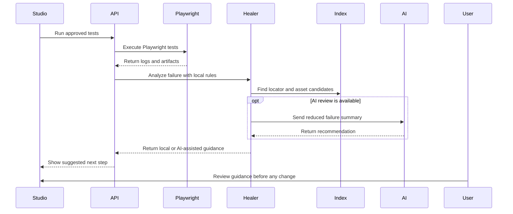

# Self-Healing Sequence

```mermaid
sequenceDiagram
  participant Studio
  participant API
  participant Playwright
  participant Healer
  participant Index
  participant AI
  participant User

  Studio->>API: Run approved tests
  API->>Playwright: Execute Playwright tests
  Playwright-->>API: Return logs and artifacts
  API->>Healer: Analyze failure with local rules
  Healer->>Index: Find locator and asset candidates
  opt AI review is available
    Healer->>AI: Send reduced failure summary
    AI-->>Healer: Return recommendation
  end
  Healer-->>API: Return local or AI-assisted guidance
  API-->>Studio: Show suggested next step
  User->>Studio: Review guidance before any change
```
