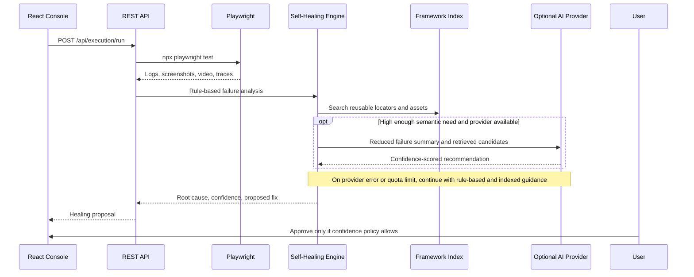

# Self-Healing Sequence

```mermaid
sequenceDiagram
  participant UI as React Console
  participant API as REST API
  participant PW as Playwright
  participant HEAL as Self-Healing Engine
  participant IDX as Framework Index
  participant AI as Optional AI Provider
  participant U as User

  UI->>API: POST /api/execution/run
  API->>PW: npx playwright test
  PW-->>API: Logs, screenshots, video, traces
  API->>HEAL: Rule-based failure analysis
  HEAL->>IDX: Search reusable locators and assets
  opt High enough semantic need and provider available
    HEAL->>AI: Reduced failure summary and retrieved candidates
    AI-->>HEAL: Confidence-scored recommendation
  end
  Note over HEAL,AI: On provider error or quota limit, continue with rule-based and indexed guidance
  HEAL-->>API: Root cause, confidence, proposed fix
  API-->>UI: Healing proposal
  U->>UI: Approve only if confidence policy allows
```
