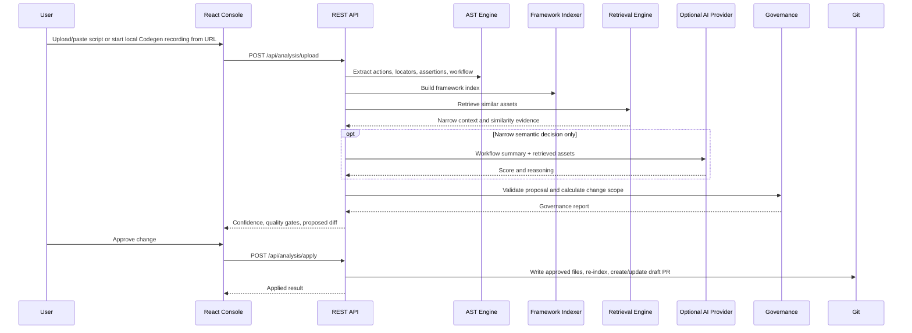

# Upload-To-Commit Sequence

```mermaid
sequenceDiagram
  participant U as User
  participant UI as React Console
  participant API as REST API
  participant AST as AST Engine
  participant IDX as Framework Indexer
  participant RET as Retrieval Engine
  participant AI as Optional AI Provider
  participant GOV as Governance
  participant GIT as Git

  U->>UI: Upload/paste script or start local Codegen recording from URL
  UI->>API: POST /api/analysis/upload
  API->>AST: Extract actions, locators, assertions, workflow
  API->>IDX: Build framework index
  API->>RET: Retrieve similar assets
  RET-->>API: Narrow context and similarity evidence
  opt Narrow semantic decision only
    API->>AI: Workflow summary + retrieved assets
    AI-->>API: Score and reasoning
  end
  API->>GOV: Validate proposal and calculate change scope
  GOV-->>API: Governance report
  API-->>UI: Confidence, quality gates, proposed diff
  U->>UI: Approve change
  UI->>API: POST /api/analysis/apply
  API->>GIT: Write approved files, re-index, create/update draft PR
  API-->>UI: Applied result
```
