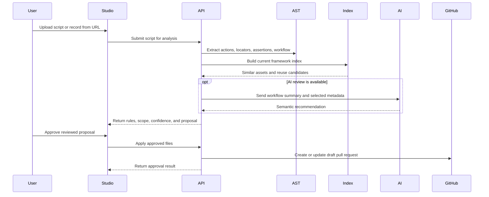

# Upload-To-Commit Sequence

```mermaid
sequenceDiagram
  participant User
  participant Studio
  participant API
  participant AST
  participant Index
  participant AI
  participant GitHub

  User->>Studio: Upload script or record from URL
  Studio->>API: Submit script for analysis
  API->>AST: Extract actions, locators, assertions, workflow
  API->>Index: Build current framework index
  Index-->>API: Similar assets and reuse candidates
  opt AI review is available
    API->>AI: Send workflow summary and selected metadata
    AI-->>API: Semantic recommendation
  end
  API-->>Studio: Return rules, scope, confidence, and proposal
  User->>Studio: Approve reviewed proposal
  Studio->>API: Apply approved files
  API->>GitHub: Create or update draft pull request
  API-->>Studio: Return approval result
```
